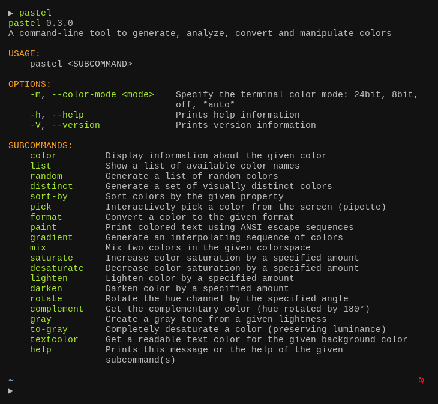

# pastel

[](https://travis-ci.org/sharkdp/pastel)
[](https://github.com/sharkdp/pastel/releases)
[](https://crates.io/crates/pastel)
[](https://crates.io/crates/pastel)


`pastel` is a command-line tool to generate, analyze, convert and manipulate colors. It supports many different color formats and color spaces like RGB, HSL, CIELAB, CIELCh as well as ANSI 8-bit and 24-bit representations.

## In action



## Tutorial

### Getting help

`pastel` provides a number of commands like `saturate`, `mix` or `paint`. To see a complete list, you can simply run
``` bash
pastel
```
To get more information about a specific subcommand (say `mix`), you can call `pastel mix -h` or `pastel help mix`.

### Composition

Many `pastel` commands can be composed by piping the output of one command to another, for example:
``` bash
pastel random | pastel mix red | pastel lighten 0.2 | pastel format hex
```

### Specifying colors

Colors can be specified in many different formats:
```
lightslategray
'#778899'
778899
789
'rgb(119, 136, 153)'
'119,136,153'
'hsl(210, 14.3%, 53.3%)'
```

Colors can be passed as positional arguments, for example:
```
pastel lighten 0.2 orchid orange lawngreen
```
They can also be read from standard input. So this is equivalent:
```
printf "%s\n" orchid orange lawngreen | pastel lighten 0.2
```
You can also explicitly specify which colors you want to read from the input. For example, this mixes `red` (which is read from STDIN) with `blue` (which is passed on the command line):
```
pastel color red | pastel mix - blue
```

### Use cases and demo

#### Converting colors from one format to another

``` bash
pastel format hsl ff8000
```

#### Show and analyze colors on the terminal

``` bash
pastel color "rgb(255,50,127)"

pastel color 556270 4ecdc4 c7f484 ff6b6b c44d58
```

#### Pick a color from somewhere on the screen

``` bash
pastel pick
```

#### Get a list of all X11 / CSS color names

``` bash
pastel list
```

#### Print colorized text from a shell script

``` bash
bg="hotpink"
fg="$(pastel textcolor "$bg")"

pastel paint "$fg" --on "$bg" "well readable text"
```

``` bash
pastel paint -n black --on red --bold "   ERROR!   "
echo " A serious error"

pastel paint -n black --on yellow --bold "  WARNING!  "
echo " A warning message"

pastel paint -n black --on limegreen --bold "    INFO    "
echo -n " Informational message with a "
echo -n "highlighted" | pastel paint -n default --underline
echo " word"
```

## Installation

### On Debian-based systems

``` bash
wget "https://github.com/sharkdp/pastel/releases/download/v0.4.0/pastel_0.4.0_amd64.deb"
sudo dpkg -i pastel_0.4.0_amd64.deb
```

### On other distributions

Check out the [release page](https://github.com/sharkdp/pastel/releases) for binary builds.

### Via cargo

If you have Rust 1.35 or higher, you can install `pastel` from source via `cargo`:
```
cargo install pastel
```

## Resources

Interesting Wikipedia pages:

* [Color difference](https://en.wikipedia.org/wiki/Color_difference)
* [CIE 1931 color space](https://en.wikipedia.org/wiki/CIE_1931_color_space)
* [CIELAB color space](https://en.wikipedia.org/wiki/CIELAB_color_space)
* [Line of purples](https://en.wikipedia.org/wiki/Line_of_purples)
* [Impossible color](https://en.wikipedia.org/wiki/Impossible_color)
* [sRGB](https://en.wikipedia.org/wiki/SRGB)
* [Color theory](https://en.wikipedia.org/wiki/Color_theory)
* [Eigengrau](https://en.wikipedia.org/wiki/Eigengrau)

Color names:

* [XKCD Color Survey Results](https://blog.xkcd.com/2010/05/03/color-survey-results/)
* [Peachpuffs and Lemonchiffons - talk about named colors](https://www.youtube.com/watch?v=HmStJQzclHc)
* [List of CSS color keywords](https://www.w3.org/TR/SVG11/types.html#ColorKeywords)

Maximally distinct colors:

* [How to automatically generate N "distinct" colors?](https://stackoverflow.com/q/470690/704831)
* [Publication on two algorithms to generate (maximally) distinct colors](http://citeseerx.ist.psu.edu/viewdoc/summary?doi=10.1.1.65.2790)

Other articles and videos:

* [Color Matching](https://www.youtube.com/watch?v=82ItpxqPP4I)
* [Introduction to color spaces](https://ciechanow.ski/color-spaces/)

## License

Licensed under either of

 * Apache License, Version 2.0, ([LICENSE-APACHE](LICENSE-APACHE) or http://www.apache.org/licenses/LICENSE-2.0)
 * MIT license ([LICENSE-MIT](LICENSE-MIT) or http://opensource.org/licenses/MIT)

at your option.
